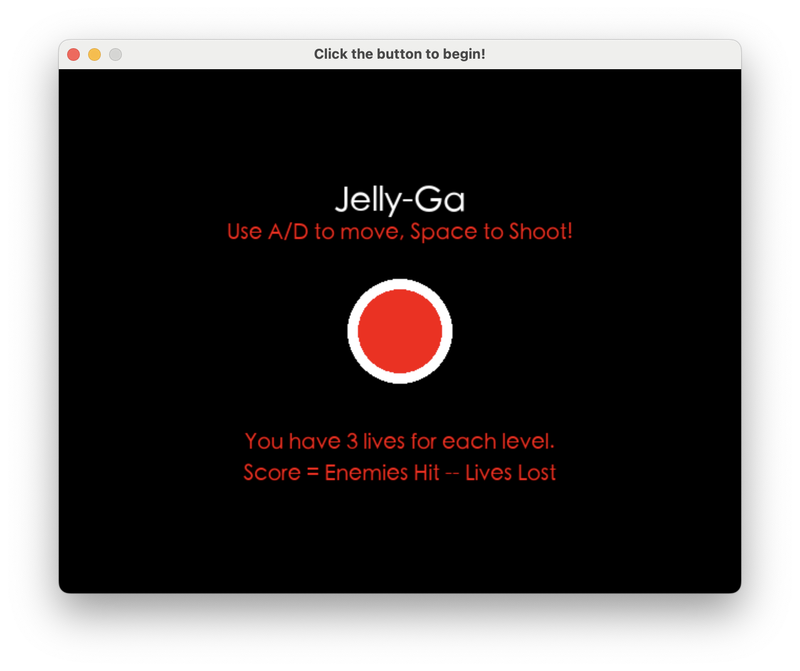
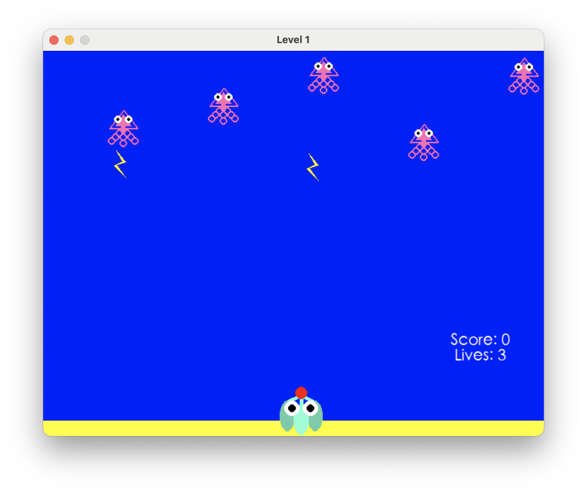

The first independent computing project I ever completed was the final project in my first Computer Science 
at Hendrix. We were tasked with creating any kind of Python program that had a graphical user interface (GUI). We had just learned 
about PyGame, so it felt natural to make a game! I grew up playing Galaga with my dad, so I wanted to create something similar.
I decided to create an underwater version of Galaga, which I called "JellyGa," with jellyfish as the attackers. 

## Main Menu

The game opens on a main menu, seen above, and has three levels of increasing difficulty. Between each level is a new start screen,
which allows you to take a quick break between rounds. You play as a small piece of coral. To kill the jellyfish, you can shoot them with bubbles. They will shoot electricity back at you! If you are hit three times, you lose. If you clear all of the jellyfish, you move on to the next level.

## Gameplay Example

The primary lesson from this project was to **keep my code organized**. This project, while not particularly complicated, was my first real exploration and implementation of Python classes. It was easy to get confused from my own code. I found that annotating my code with lots of comments and prioritizing informative variable and function names was helpful.

While this project had little to do with biology, it was my very first foray into coding, and shows just how far I've come
over the last 3 years!

