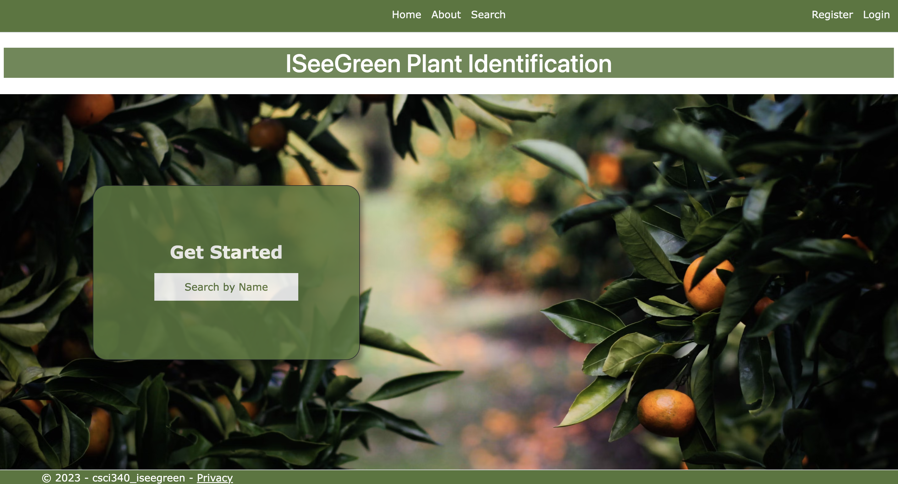
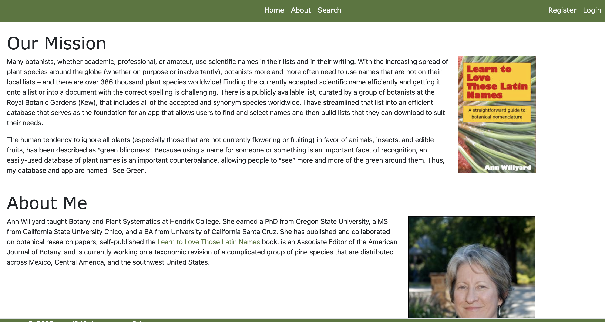
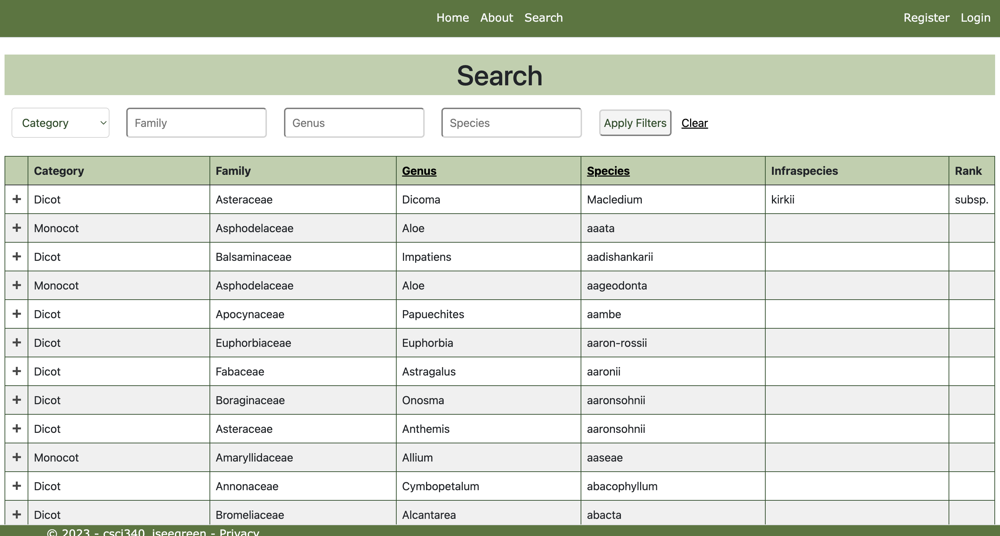

This project was my final in Databases and Websystems at Hendrix. In this class, we were sorted into random groups and assigned clients to work with! For this project, I worked with a retired professor to design and create a website for identifying plants by their scientific names, similar to the Cornell Bird App. Our overall goals were to make plant names more accessible and less intimidating to users, as well as allow users to create personalized lists of plants. 

## Title Screen

## About Page

This website was deployed on Azure! My role in this group project was largely based in the front end, working to organize the website and design the title and search screens. Users can search by Family, Genus, or Species, as well as filter by certain categorical variables. There are over 300,000 accepted taxa in the database, which can each be added to a users' personalized lists. 

## Search Page

Building this website came with a huge learning curve for me! I knew nothing about Azure at this time and it ended up being my first encounter with CSS, Javascript, and C, all at the same time. My group was definitely most proud of the ability to search the large database. 

