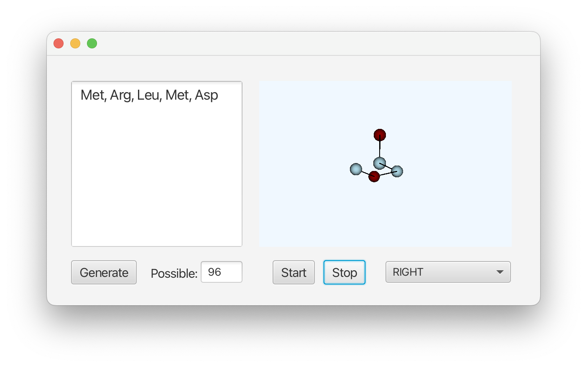
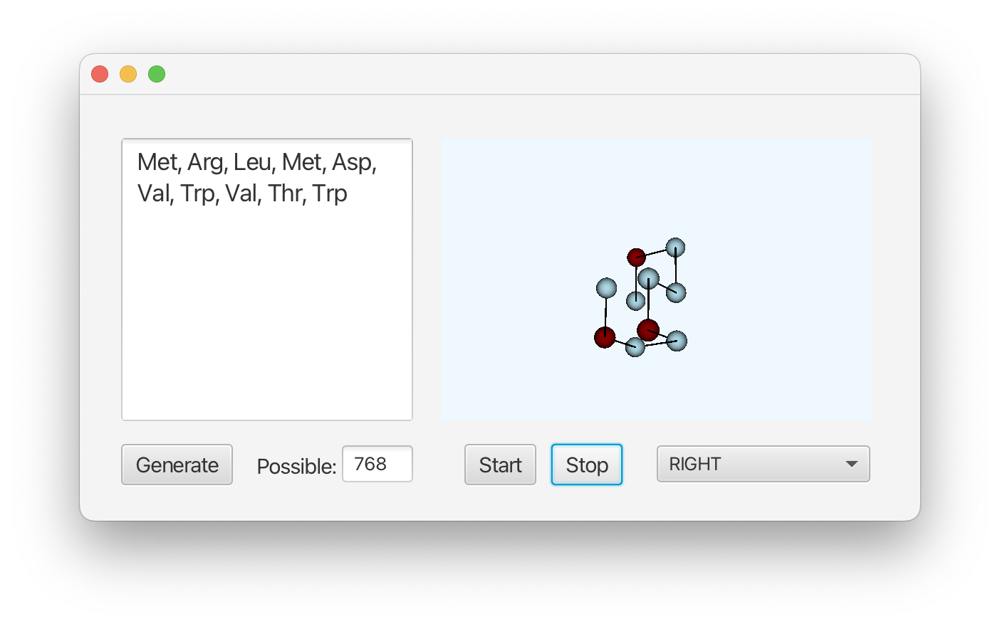

This project was my final for Data Structures, the second Computer Science course at Hendrix. It took me a surprisingly long time! We were only required to use Java and one of the data structures that we had learned in class, so it was hard to pick something. Fortunately, I am a frequent reader of *Nature* and had just read an article about **AlphaFold** when this project was assigned! Clearly, I wasn't going for accuracy in my three-week protein structure predictor, but it was an interesting project that allowed me to learn a lot about how prediction works!

## Main Menu

A "lattice model" is a simplified model that predicts the 3D folded structure of a given protein. It does this by building the model based on only hydrophobic, or nonpolar, interactions. Proteins are built out of monomers called amino acids, each of which can be described as polar or nonpolar. A polar molecule is a molecule in which the distribution of electrical charge over atoms is uneven. Additionally, some amino acids are positively or negatively charged, but for the sake of this project, anything that wasn't explicitly nonpolar was designated as polar. 

The model places the protein onto a 3D grid and counts how many nonpolar interactios there are between nonpolar amino acids. A nonpolar interaction was defined as two nonpolar amino acids only one coordinate away from each other. The program runs every possible conformation, assigns them a score based on the number of nonpolar interactions, and visualizes the conformation with the highest score. If there are multiple conformations with the same high score, one is picked at random. The number of possible fold conformations is displayed on the graphical user interface (GUI).

## Gameplay Example

One of the biggest challenges I faced with this project weas evaluating the conformations. I did not attempt to include stereochemistry of any kind in this project, therefore many of the final structures were practically identical. If I was going to re-do this project, I might attempt to include diagonal interactions between nonpolar amino acids, as some lattice models consider them equally to non-diagonal interactions. 

Additionally, learning to use JavaFX to create the GUI and visualize the structure was quite challenging! I learned to use the JavaFX Camera, so that the predicted structure could be viewed in three dimensions. It could be interesting to go back in the future and re-code the Camera to move in increments, instead of rotating indefinitely as it does currently. 

