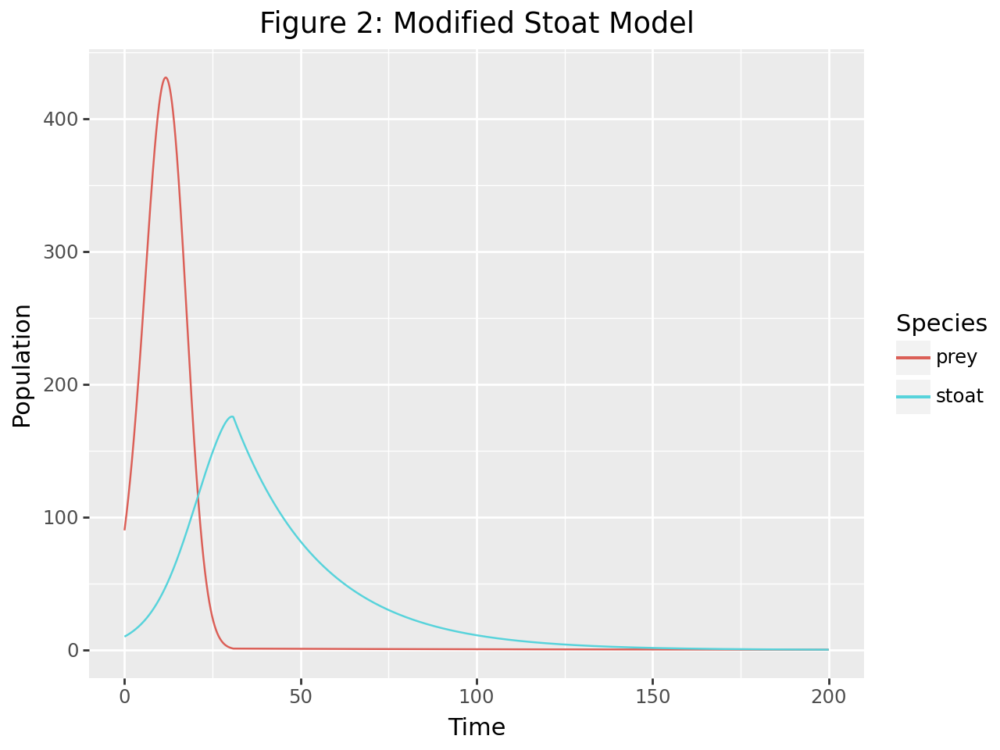
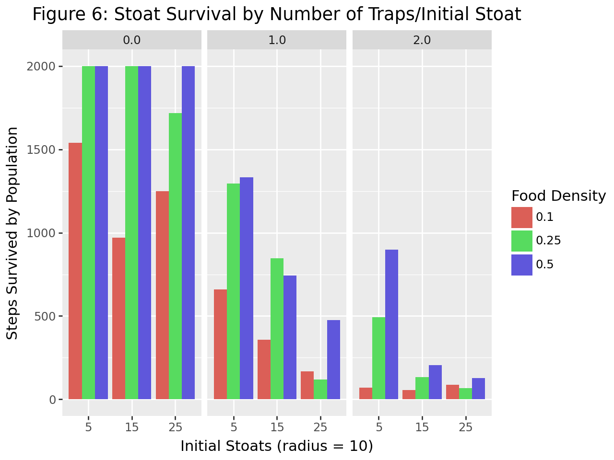

*Header: "Stoat | Jispa, Himachal Pradesh" by soumyajit nandy is licensed under CC BY-SA 2.0. To view a copy of this license, visit https://creativecommons.org/licenses/by-sa/2.0/?ref=openverse.*

This project was my final in Scientific Computing at Hendrix. In this class, we were paired up for the final project. Most groups' topics were sourced from the COMAP Mathematical Contest in Modeling, but my partner and I both wanted a topic with a greater biological focus. We decided to focus on modeling invasive stoat populations in New Zealand. 

Stoat populations in New Zealand have been a key factor for the decline of endemic species on the islands since their introduction in the late 19th century. Endemic bird populations have observed the steepest decline, with many ground-nesting birds oblivious to the newly-introduced predator. The aims of our project were to (1) model the spread and growth of invasive stoat populations on an isolated island, (2) model and determine the optimal number of stoat traps, and (3) expand our model to account for key endemic bird and other prey populations. 

## Population Dynamics

To model the growth of stoat populations and subsequent prey populations, we first used dynamical system modeling. We initially used the Lotka-Volterra predator prey model, ut found that the model was limited by initial populations of predators. We then pivoted to a modified logistic model that included additional considerations such as hunting efficiency and rate of predation. 

## Agent Based Modeling

In order to account for island size, we used agent-based modeling to describe population growth and spread. The primary driver of the stoats' behavior was hunger, though the model was limited by generalizations to the behaviors of prey populations. We evaluated this model by counting how many model steps were required for all of the stoats to die, with a maximum of 2000 steps. 

Our findings suggested that stoat populations have a signifcant impact on prey populations in New Zealand islands. The presence of stoats could mean the extinction of many endemic bird species. A 1:1 ratio of traps to stoats seemed to be the most efficient and practical solution for managing stoat populations, though early and proactive trapping is key. 

View the full project [HERE](https://www.kaggle.com/code/katejackson02/modeling-invasive-stoats-on-new-zealand-islands)!

