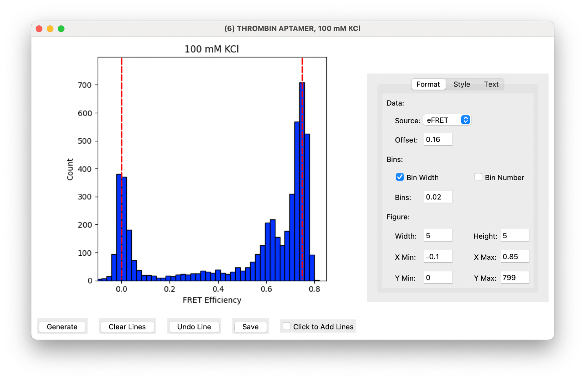

My computer science thesis project is called smFRET Toolkit: Python-Based Tools for Analysis and Visualization of Single-Molecule FRET Data. **This project is ongoing!**

Single-molecule fluorescence resonance energy transfer (FRET) is an adaptable biophysical technique for the analysis of conformational changes in biological systems. Often compared to a molecular ruler, FRET uses high-contrast microscopes and fluorescent reporters to detect subtle, nano-scale changes in space. Single-molecule FRET can evaluate these changes with previcion, allowing for identification of rare or temporary states. A major limitation in current single-molecule FRET studies is the breadth of expensive and outdated software used for data acquisition, processing, and visualization. smFRET Toolkit is an open-source solution to this problem. It organizes and displays fluorescence time trajectories for individual molecules, FRET efficiency charts, and histograms from experimental data. 

## smFRET example

Fluorescence resonance energy transfer (FRET) is a process in which energy is transferred from a donor fluorophore to an acceptor fluorophore, resulting in changes to the relative brightness of each of them. The efficiency of energy transfer is inversely related to the distance between the two fluorophores. When they are close together, the energy transfer is high and the acceptor (shown in red) is relatively bright. When they are far apart the energy transfer is low and the acceptor is relatively dim.

Scientists can then use this distance-dependent relationship to detect structural changes in individual biological molecules (ie Single-molecule FRET). We can also calculate the “FRET Efficiency” from the intensities of the two fluorophores to visualize this relationship. 

## Trajectory Viewer

The first part of my project is a GUI which allows users to view the intensities of fluorophores over time. The donor is displayed in green and the acceptor is displayed in red. Below, we see the calculated FRET efficiency. This screen comes with an extensive set of customization options, allowing users to modify and save their views for later use. 

## Histogram Maker

The second part of the project is a histogram maker. From thousands of trajectories, we can build FRET efficiency histograms, which give a snapshot of the conformations of molecules at a given time. Again, this screen comes with many customization options, allowing users to modify and save their histograms. 

View the full project [HERE](https://github.com/k-atej/smFRET)!

